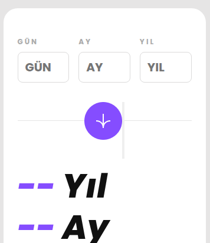

# React + Vite

This template provides a minimal setup to get React working in Vite with HMR and some ESLint rules.

Currently, two official plugins are available:

- [@vitejs/plugin-react](https://github.com/vitejs/vite-plugin-react/blob/main/packages/plugin-react) uses [Oxc](https://oxc.rs)
- [@vitejs/plugin-react-swc](https://github.com/vitejs/vite-plugin-react/blob/main/packages/plugin-react-swc) uses [SWC](https://swc.rs/)

## React Compiler

The React Compiler is not enabled on this template because of its impact on dev & build performances. To add it, see [this documentation](https://react.dev/learn/react-compiler/installation).

## Expanding the ESLint configuration

If you are developing a production application, we recommend using TypeScript with type-aware lint rules enabled. Check out the [TS template](https://github.com/vitejs/vite/tree/main/packages/create-vite/template-react-ts) for information on how to integrate TypeScript and [`typescript-eslint`](https://typescript-eslint.io) in your project.

# TR
# Yaş Hesaplayıcı
Gün, ay ve yıl bilgisi alarak tam yaşı yıl, ay ve gün cinsinden hesaplayan, React ile geliştirilmiş duyarlı bir web uygulaması.

## Canlı Önizleme

[Proje önizlemesi.](https://dursunkokturk.github.io/React-JS-Project-Age-Calculator)

## Özellikler

- Gerçek Zamanlı Doğrulama — Her alan değiştiğinde anlık hata kontrolü
- Alan Bazlı Hata Mesajları — Gün, ay ve yıl için ayrı ayrı hata gösterimi
- Artık Yıl Desteği — Şubat ayı için 28/29 gün doğrulaması
- Ay Uzunluğu Kontrolü — getDaysInMonth ile her ayın doğru gün sayısı hesaplanır
- Borç Alma Algoritması — Negatif gün ve ay değerlerini doğru telafi eder
- Koşullu Buton Görseli — Mobilde küçük, masaüstünde büyük hesapla butonu
- Tam Duyarlı Tasarım — Mobil ve masaüstü için ayrı düzenler

## Duyarlı Düzenler

| Ekran    | Genişlik         | Düzen                                               |
| -------- |------------------| ----------------------------------------------------|
| Mobil    | 375px Varsayılan | 343px kart, ortalanmış buton, 56px sonuç fontu      |
| Masaüstü | ≥ 1109px         | 840px kart, sağa yaslanmış buton, 104px sonuç fontu |

## Teknolojiler

| Teknoloji  | Açıklama                                        |
| ---------- |-------------------------------------------------|
| React 18   | Bileşen yapısı ve state yönetimi                |
| CSS3       | Flexbox, CSS değişkenleri, @media sorguları     |
| JavaScript | Artık yıl, ay uzunluğu ve yaş hesaplama mantığı |

## Proje Yapısı
src/  
├── App.jsx        # Tüm uygulama mantığı ve arayüz  
├── App.css        # Global stiller  
└── assets/  
    └── img/  
        ├── circle-mobile.png    # Mobil hesapla butonu  
        └── circle-desktop.png   # Masaüstü hesapla butonu  

## Kurulum
bash# Repoyu klonlayın  
git clone https://github.com/kullanici-adi/age-calculator.git

### Proje klasörüne girin
cd age-calculator

### Bağımlılıkları yükleyin
npm install

### Geliştirme sunucusunu başlatın
npm run dev  
Tarayıcınızda http://localhost:5173 adresini açın.

## Hesaplama Mantığı

- Kullanıcı gün, ay ve yıl alanlarını doldurur
- Her alan değiştiğinde anlık doğrulama çalışır:
  - Boş alan kontrolü
  - Sayısal değer kontrolü
  - Gün için ay uzunluğu ve artık yıl kontrolü
  - Ay için 1–12 aralığı kontrolü
  - Yıl için bugünden büyük olmama kontrolü
- Hesapla butonuna basıldığında tüm form yeniden doğrulanır
- Doğrulama geçilirse Date nesnesiyle yıl, ay, gün hesaplanır
- Negatif değerler için borç alma algoritması devreye girer
- Sonuçlar -- yerine hesaplanan değerlerle güncellenir

## Tasarım Detayları

- Renk Paleti:

  - #854DFF — Mor vurgu (sonuç değerleri, input focus)
  - #FF5959 — Kırmızı (hata mesajları)
  - #ABABAB — Gri (etiketler)
  - #e6e5e5 — Açık gri (body arka planı)

- Font: Poppins
- Kart Köşesi: Sağ alt köşe border-radius: 100px (masaüstünde 200px) ile yuvarlak

# EN
# Age Calculator
A responsive web app built with React that calculates your exact age in years, months, and days from a given day, month, and year.

## Live Preview
[Project preview.](https://dursunkokturk.github.io/React-JS-Project-Age-Calculator)

## Features

- Real-Time Validation — Instant error checking as each field changes
- Field-Level Error Messages — Separate error display for day, month, and year
- Leap Year Support — 28/29 day validation for February
- Month Length Check — Correct day count per month calculated with getDaysInMonth
- Borrowing Algorithm — Correctly compensates for negative day and month values
- Conditional Button Image — Smaller calculate button on mobile, larger on desktop
- Fully Responsive Design — Separate layouts for mobile and desktop

## Responsive Layouts

| Screen  | Width         | Layout                                                             |
| ------- |---------------| -------------------------------------------------------------------|
| Mobile  | 375px Default | Desktop≥ 1109px840px card, right-aligned button, 104px result font |
| Desktop | ≥ 1109px      | 840px card, right-aligned button, 104px result font                |

## Technologies

| Technology | Description                                        |
| ---------- |----------------------------------------------------|
| React 18   | Component structure and state management           |
| CSS3       | Flexbox, CSS variables, @media queries             |
| JavaScript | Leap year, month length, and age calculation logic |

## Project Structure
src/  
├── App.jsx        # All application logic and UI  
├── App.css        # Global styles  
└── assets/  
    └── img/  
        ├── circle-mobile.png    # Mobile calculate button  
        └── circle-desktop.png   # Desktop calculate button  

## Installation
bash# Clone the repo  
git clone https://github.com/username/age-calculator.git

### Navigate to the project folder
cd age-calculator

### Install dependencies
npm install

### Start the development server
npm run dev  
Open http://localhost:5173 in your browser.

## Calculation Logic

- User fills in the day, month, and year fields
- Instant validation runs on every field change:
  - Empty field check
  - Numeric value check
  - Day validation against month length and leap year
  - Month range check (1–12)
  - Year must not be in the future
- On clicking Calculate, the entire form is re-validated
- If validation passes, years, months, and days are calculated using the Date object
- The borrowing algorithm kicks in for negative values
- Results update from -- to the calculated values

## Design Details
- Color Palette:

  - #854DFF — Purple accent (result values, input focus)
  - #FF5959 — Red (error messages)
  - #ABABAB — Grey (labels)
  - #e6e5e5 — Light grey (body background)

- Font: Poppins
- Card Corner: Bottom-right corner rounded with border-radius: 100px (200px on desktop)
